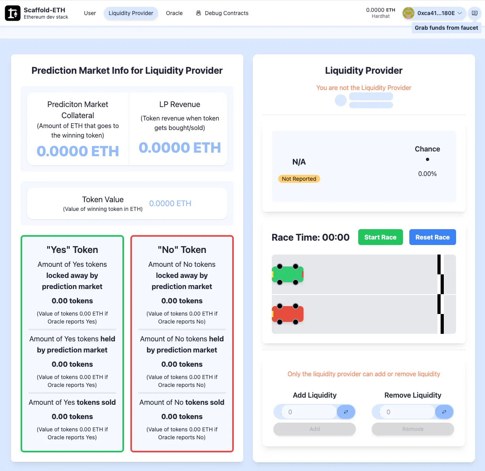
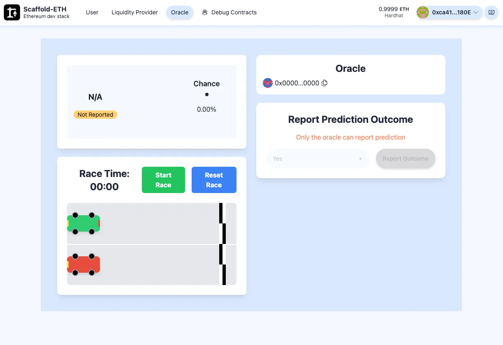
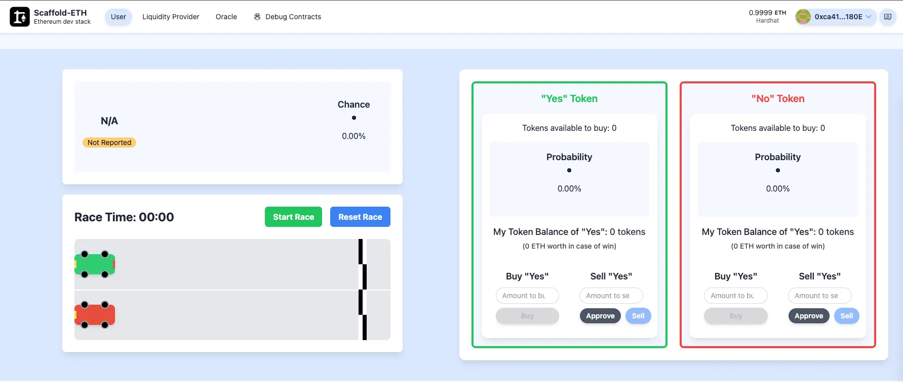
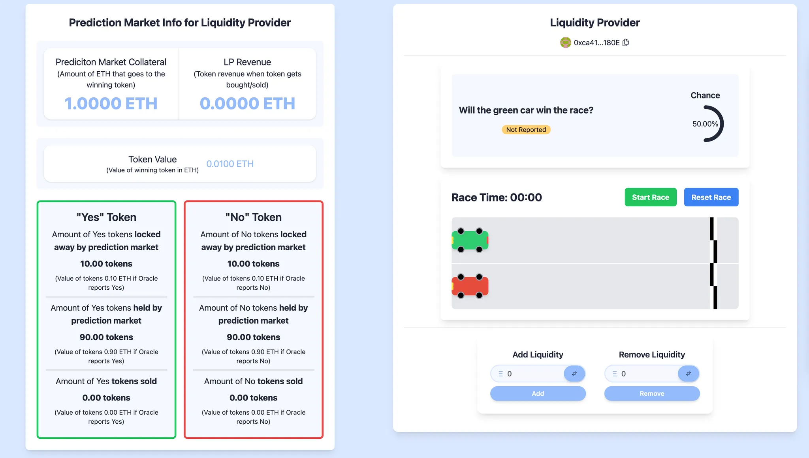
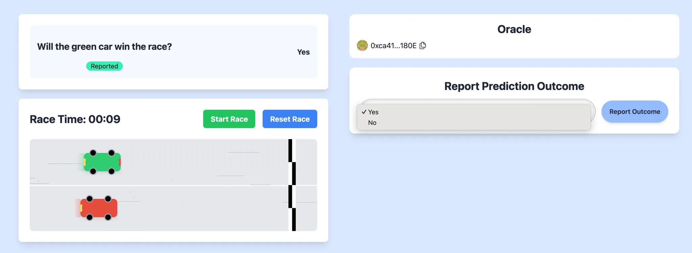
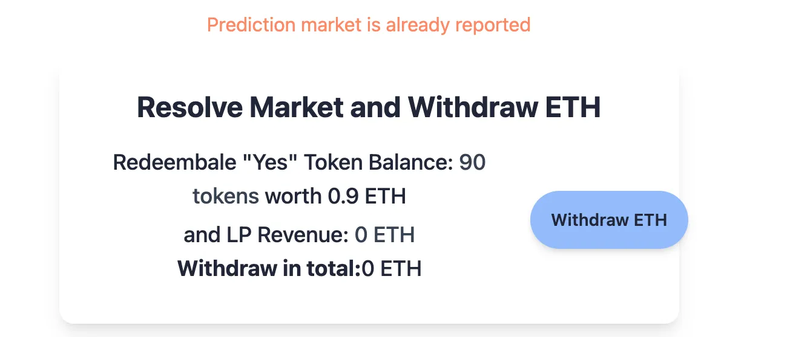
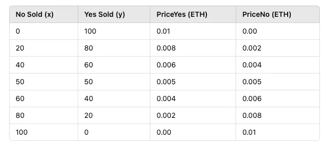
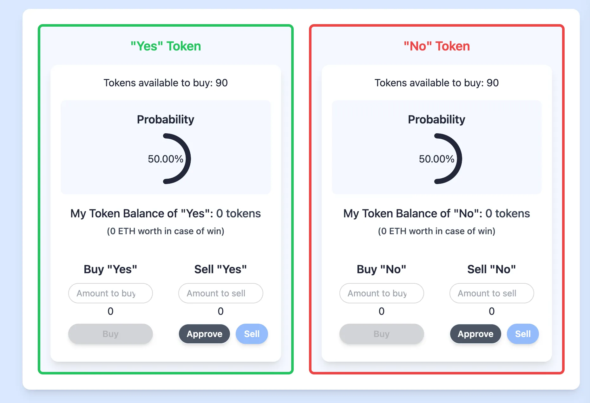
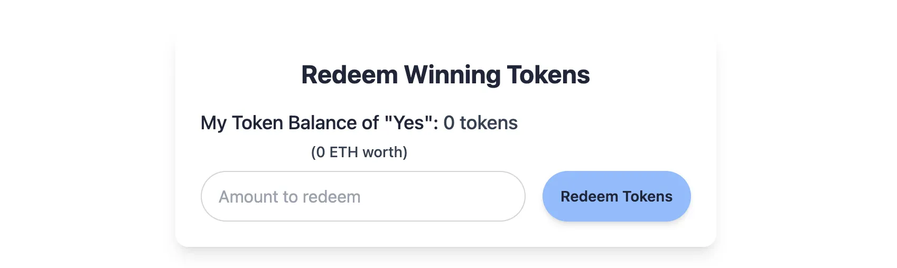

# 🚩 Challenge 6:📈📉 Build a Prediction Market


## Introduction

Prediction markets have been around for a long time, with records of **election betting on Wall Street dating back to 1884** (see [this Wikipedia page](https://en.wikipedia.org/wiki/Prediction_market)). On **Ethereum**, they’ve been a topic of interest for quite some time, but they never really took off, until now.

Polymarket, a prediction market, is one of the most widely used blockchain applications today by both crypto natives and everyday users. It gained especially significant traction around the **U.S. elections.**

For example, during the **2024 U.S. Presidential Election**, Polymarket saw over **$3.3 billion** wagered on the race between **Donald Trump and Kamala Harris** (as of November 5, 2024). [[Source](https://en.wikipedia.org/wiki/Polymarket)]

At its core, a prediction market is a **betting market** where users can wager on the outcome of a future event with a **fixed end date**. The key difference from ltraditional betting platforms is that, in most cases, **once you place a bet, you're locked in**. But in a **prediction market**, you can **sell your position** before the event concludes.

The more people bet on a particular outcome, the **more expensive** that side becomes, while the opposite side gets **cheaper**. This **dynamic pricing mechanism** determines an implied **probability**, which can sometimes be more accurate than expert opinions, polls, or pundits.

In this tutorial, we'll guide you through the fundamental Solidity functions and explore how a fully on-chain prediction market could be structured. Our focus will be on trading and liquidity provision. This decentralized prediction market enables anyone to place bets on a predefined question with the two outcomes “Yes” or “No”.

## Functioning of our prediction market

In our prediction market, users can bet on the outcome of a race between a green and a red car by answering:

> ❓ **Will the green car win the race?**

This is a **binary prediction market** with two outcome tokens: **"Yes"** and **"No."** A winning share is worth **0.01 ETH**, while the losing share is worth **0 ETH**. Before the outcome is known, token prices fluctuate between **0 and 0.01 ETH**, reflecting the perceived probability. The combined price of both tokens always equals **0.01 ETH,** similar to Polymarket, where a winning share is worth **1 USDC**. A fundamental rule in such markets is that **the combined price of both shares ("Yes" and "No") always equals the winning share value.**

Unlike traditional betting markets that lock users into their positions, our market lets **user trade** **outcome shares any time**. While platforms like Polymarket use order books, we use an **Automated Market Maker (AMM)**, enabling users buy or sell shares without needing a counterparty to sell or buy to (and it’s easier to implement and less gas-intensive).

To create a market, **liquidity must be provided upfront** so that both outcome tokens are backed by collateral. Liquidity providers bear risk, as losing tokens become worthless, but they earn **trading fees** in return. Therefore, it is important that the market attract **active trading and user interest**. That is one of the reasons why on platforms, like Polymarket, market creation is curated by the team and community (see their [docs](https://learn.polymarket.com/docs/guides/get-started/what-is-polymarket/)).

A key challenge for **on-chain** prediction markets is **reporting the answer (outcome) to off-chain questions**. Since blockchains **cannot access real-world data**, they rely on **oracles** to fetch external information in a **decentralized and trustworthy** way.

But now enough explanation, let's jump into the challenge.

## **Checkpoint 0: 📦 Environment 📚**

Before you begin, you need to install the following tools:

- [Node (v18 LTS)](https://nodejs.org/en/download/)
- Yarn ([v1](https://classic.yarnpkg.com/en/docs/install/) or [v2+](https://yarnpkg.com/getting-started/install))
- [Git](https://git-scm.com/downloads)

Then download the challenge to your computer and install dependencies by running:

```
npx create-eth@0.1.0 -e challenge-6-prediction-market challenge-6-prediction-market
cd challenge-6-prediction-market
```

in the same terminal, start your local network (a blockchain emulator in your computer):

```javascript
yarn chain
```

in a second terminal window, 🛰 deploy your contract (locally):

```javascript
cd challenge-6-prediction-market
yarn deploy
```

in a third terminal window, start your 📱 frontend:

```javascript
cd challenge-6-prediction-market
yarn start
```

📱 Open [http://localhost:3000](http://localhost:3000/) to see the app.

> 👩‍💻 Rerun yarn deploy whenever you want to deploy new contracts to the frontend. If you haven't made any contract changes, you can run yarn deploy --reset for a completely fresh deploy.

Head to the **`Debug Contracts`** tab and you should find a smart contract named **`PredictionMarket`**. This is our main contract and the one we’ll be working on throughout the challenge. Since we haven’t implemented any functions yet, they all shouldn’t work neither do you see all necessary state variables.

> 🏎️ 🏁 Since we want to build a prediction market around our car race head to the `User` tab and it! (The race is entirely separate and has no impact on the smart contract.)

## **Checkpoint 1: 🔭 The Structure of the protocol 📺**

A fully on-chain prediction market generally consists of three key components:

- Tokens (ERC20, ERC1155, etc.)
- Trading and liquidity provision mechanism (AMM, order book, etc.)
- Oracle

Our contract uses ERC20 tokens, which are deployed whenever we deploy our prediction market. It generates two ERC20 token contracts, representing the possible outcomes, “Yes” and “No”.

These tokens are defined in `packages/hardhat/contracts/PredictionMarketToken.sol`, which extends the standard ERC20 with custom minting and burning logic. We've also implemented a restriction that prevents the prediction market owner from transferring tokens (the reason will be explained later). Go ahead and review that contract first.

The main contract `PredictionMarket.sol` we’ll build during this challenge is at `packages/hardhat/contracts/PredictionMarket.sol`. Our prediction market involves the three key roles:

1. **Prediction Market Owner & Liquidity Provider** – sets up and funds the market
2. **Oracle** – reports the final outcome of the prediction
3. **User** – places bets on outcomes to win ETH

In this challenge, you’ll take on all three roles. But we’ll begin with the **market owner and** **liquidity provider**, since without them, the market can’t exist.

In an AMM system, initial liquidity is essential. **When a new prediction market is created, our prediction market creator acts as the liquidity provide**r. It deposits ETH as collateral, and in return, the protocol creates the two token contracts "Yes" and "No" and mints tokens accordingly. Additionally, the liquidity provider can also add or remove liquidity. In **Checkpoints 2 to 4 and 6**, you'll implement the logic needed to complete the Liquidity Provider functionalities under the `Liquidity Provider` tab

> ❗️In the current state your front-end is already implemented but the buttons of the different function will likely break since there is no implementation code within your smart contracts yet. But soon there will! 🙂



In **Checkpoint 5**, you’ll bring the Oracle to life by implementing the logic for outcome reporting.



Finally, in **Checkpoints 7 to 9**, we shift our focus to the User, where you'll implement the functionalities: **buying, selling, and redeeming** outcome tokens.



> 🎉 You've made it this far in Scaffold-Eth Challenges 👏🏼 . As things get more complex, it might be good to review the design requirements of the challenge first! Check out the empty PredictionMarket.sol file to see aspects of each function. If you can explain how each function will work with one another, that's great! 😎

> 🚨 🚨 🦈 The Guiding Questions will lead you in the right direction, but try thinking about how you would structure each function before looking at these!

> 🚨 🚨 🦖 The code blobs within the toggles in the Guiding Questions are some examples of what you can use, but try writing the implementation code for the functions first!

## **Checkpoint 2: 🔭 The Prediction Market Setup 🏠**

To deploy our prediction market contract successfully, we first need to properly set up the constructor and create the necessary state variables.

Parameters we want to declare:

- `*_*oracle`: the address of the **oracle**
- `_question`: the **question** posed by the prediction market
- `_initialTokenValue`: defines how much each token is worth in case of winning (0.01 ETH)
- `_initialYesProbability`: the starting probability of the “Yes” outcome (e.g., 50%)
- `_percentageToLock`: a value used in calculating both the probability and the token price (you’ll explore this further in Checkpoint 3)

And additional state variables we want to create:

- `s_ethCollateral`: the ETH sent during deployment, used to back the value of the outcome tokens, you can think of it as the **winning pot**
- `s_lpTradingRevenue`: tracks how much revenue the market earns from users buying tokens

> ❗️For easier testing, we set the oracle address to be the same as the liquidity provider during deployment (see `00_deploy_your_contract.ts`).

> ⏰ 🚨 In a prediction market in production, you would typically include a time-based restriction, a **fixed end date** to ensure that outcomes can only be reported after the predicted event occurs. For simplicity and ease of testing, we omit this time component in this implementation.

> 💡 `i_<variableName>` indicates an immutable variable, whereas `s_<variableName>` is a normal state variable that can be modified.

Alright, let’s head to the contract and start setting up our state variables and the first part of the constructor. Consider implementing important conditional checks.

<details markdown='1'><summary>🦉 Guiding Questions</summary>

<details markdown='1'><summary>Question 1</summary>

> What are the most important state variables, we need to track (Hint: look into the constructor)? How can we initialize them with the right value in the constructor? Which variables can be set to `immutable`?

</details>

<details markdown='1'><summary>Question 2</summary>

> What important checks should we include in the constructor before deploying the contract? (Hint: refer to the questions below for additional guidance, and make sure to use the appropriate custom errors from the `errors` section where applicable)

</details>

<details markdown='1'><summary>Question 3</summary>

> How can we ensure that a prediction market cannot be created without any initial liquidity?

</details>

<details markdown='1'><summary>Question 4</summary>

How do we validate that `_initialYesProbability` is within the valid range of 0% to 100%?

</details>

<details markdown='1'><summary>Question 5</summary>

> How do we prevent `_percentageToLock` from exceeding 100%?

</details>

After thinking through the guiding questions, have a look at the solution code!

<details markdown='1'><summary>👩🏽‍🏫 Solution Code</summary>

```javascript
//////////////////////////
/// State Variables //////
//////////////////////////

address public immutable i_oracle;
uint256 public immutable i_initialTokenValue;
uint256 public immutable i_percentageLocked;
uint256 public immutable i_initialYesProbability;

string public s_question;
uint256 public s_ethCollateral;
uint256 public s_lpTradingRevenue;

//////////////////
////Constructor///
//////////////////

constructor(
    address _liquidityProvider,
    address _oracle,
    string memory _question,
    uint256 _initialTokenValue,
    uint8 _initialYesProbability,
    uint8 _percentageToLock
) payable Ownable(_liquidityProvider) {
    // /// CHECKPOINT 2 ////
    if (msg.value == 0) {
        revert PredictionMarket__MustProvideETHForInitialLiquidity();
    }
    if (_initialYesProbability >= 100 || _initialYesProbability == 0) {
        revert PredictionMarket__InvalidProbability();
    }

    if (_percentageToLock >= 100 || _percentageToLock == 0) {
        revert PredictionMarket__InvalidPercentageToLock();
    }

    i_oracle = _oracle;
    s_question = _question;
    i_initialTokenValue = _initialTokenValue;
    i_initialYesProbability = _initialYesProbability;
    i_percentageLocked = _percentageToLock;

    s_ethCollateral = msg.value;

    /// CHECKPOINT 3 ////

}
```

</details>

</details>

Run the following command to check if you implement all variable and checks correctly.

```javascript
yarn test --grep "Checkpoint2"
```

> 🚨 Before we deploy the contract we need to finish implementing the constructor in the next checkpoint 3.

## **Checkpoint 3: 🔨🪙  Mint the tokens**

When deploying the prediction market contract, we also need to deploy the associated **“Yes”** and **“No”** token contracts. To ensure this happens, we instantiate both token contracts inside the constructor.

To deploy them correctly, we must provide the required parameters, as defined in `PredictionMarketToken.sol`. The first three are straightforward:

- The token **name** ("Yes", "No")
- The token **symbol** ("Y", "N")
- The **address** of the liquidity provider (i.e. the market owner)

The fourth parameter is the **initial token supply** to mint. Therefor, we divide the ETH sent during deployment by `_initialTokenValue` to calculate `initialTokenAmount`.

We store the two deployed token contract addresses in the state variables `i_yesToken` and `i_noToken`.

As the market creator, you’ll also choose the **initial probability** of the “Yes” outcome via the variable `i_initialYesProbability`. For example, if you believe the green car has a better chance of winning the race, you might set this to **60%** upfront.

To understand how this works, let’s walk through an example:

Suppose we mint 100 “Yes” and 100 “No” tokens. If users buy 60 “Yes” and 40 “No” tokens, the implied probability of “Yes” is:

Suppose we mint 100 “Yes” and 100 “No” tokens. If users buy 60 “Yes” and 40 “No” tokens, the implied probability of “Yes” is:

$$yesProbability = \frac{yesTokenSold}{yesTokenSold + noTokenSold} = \frac{60}{60 + 40} = 60\%$$

And accordingly the “No” probability is 40%.

To set an initial probability before any trades occur, we use a **token lock mechanism**. Locked tokens act as if they were already sold. In deployment these tokens are sent to the liquidity provider but are non-transferable (see `PredictionMarketToken.sol`).

To control this, we introduce the `i_percentageLocked` variable. For example, if we lock **10%** of the total supply and want to set the initial “Yes” probability to **60%**, the locked token amounts would be:

$$amountToLock = initialTokenAmount * probabilty * percentageToLock * 2 $$

Number of "Yes" tokens to lock:

$$100 * 60\% * 10\% * 2 = 12$$

Number of "No" tokens to lock:

$$100 * 40\% * 10\% * 2 = 8$$

Therefor the initial probability is:

$$\frac{12}{12 + 8} = 60\%$$

And therefor, after deployment, **88 “Yes”** and **92 “No”** tokens are available for trading (since 12 “Yes” and 8 “No” tokens will be locked).

The locking of tokens serves two purposes:

1. **Stabilizes** the initial market, preventing extreme shifts from early trades.

   Without it, a single “Yes” purchase pushes the probability to 100%:

   $$\frac{1}{1 + 0} = 100\%$$

2. **Smooths price movements** early on. Since the token price is calculated as:

   $$tokenPrice = i_initialTokenValue * marketProbability$$

> 💡 The percentage can be chosen arbitrarily, it depends on how you want to set up the prediction market. The more you lock from the beginning the lesser are the price swings but also there is less liquidity to trade.

<details markdown='1'><summary>🦉 Guiding Questions</summary>

<details markdown='1'><summary>Question 1</summary>

> How do we calculate the correct initialTokenAmount for each token? (Hint: Don’t forget to use the PRECISION constant to handle decimal values properly, as Solidity does not support floating-point arithmetic)

</details>

<details markdown='1'><summary>Question 2</summary>

> How can we create the two token contracts for “Yes” and “No” outcomes and mint the correct amount of tokens for each? (Hint: Take a look at the PredictionMarketToken.sol contract for guidance.)

</details>

<details markdown='1'><summary>Question 3</summary>

> After minting the correct amount of tokens, how do we ensure that the appropriate portion is locked away to reflect the initial probability set by the prediction market? How can we correctly transfer these locked tokens to the contract owner’s address?

</details>

After thinking through the guiding questions, have a look at the solution code!

<details markdown='1'><summary>👩🏽‍🏫 Solution Code</summary>

```javascript
//////////////////////////
/// State Variables //////
//////////////////////////

PredictionMarketToken public immutable i_yesToken;
PredictionMarketToken public immutable i_noToken;

//////////////////
////Constructor///
//////////////////

constructor(
    address _liquidityProvider,
    address _oracle,
    string memory _question,
    uint256 _initialTokenValue,
    uint8 _initialYesProbability,
    uint8 _percentageToLock
) payable Ownable(_liquidityProvider) {
    /// CHECKPOINT 2 ////
    if (msg.value == 0) {
        revert PredictionMarket__MustProvideETHForInitialLiquidity();
    }
    if (_initialYesProbability >= 100 || _initialYesProbability == 0) {
        revert PredictionMarket__InvalidProbability();
    }

    if (_percentageToLock >= 100 || _percentageToLock == 0) {
        revert PredictionMarket__InvalidPercentageToLock();
    }

    i_oracle = _oracle;
    s_question = _question;
    i_initialTokenValue = _initialTokenValue;
    i_initialYesProbability = _initialYesProbability;
    i_percentageLocked = _percentageToLock;

    s_ethCollateral = msg.value;

    /// CHECKPOINT 3 ////
    // Code goes here

    uint256 initialTokenAmount = (msg.value * PRECISION) / _initialTokenValue;
	  i_yesToken = new PredictionMarketToken("Yes", "Y", msg.sender, initialTokenAmount);
	  i_noToken = new PredictionMarketToken("No", "N", msg.sender, initialTokenAmount);

	  uint256 initialYesAmountLocked = (initialTokenAmount * _initialYesProbability * _percentageToLock * 2) / 10000;
	  uint256 initialNoAmountLocked =
	      (initialTokenAmount * (100 - _initialYesProbability) * _percentageToLock * 2) / 10000;

	  bool success1 = i_yesToken.transfer(msg.sender, initialYesAmountLocked);
	  bool success2 = i_noToken.transfer(msg.sender, initialNoAmountLocked);
	  if (!success1 || !success2) {
	      revert PredictionMarket__TokenTransferFailed();
	  }
}
```

</details>

</details>

Run the following command to check if you implement all variable and checks correctly.

```javascript
yarn test --grep "Checkpoint3"
```

If your tests have passed, you're almost there! There is one little thing we need to do before deploying the contract. Please scroll down to the `getPrediction` function and uncomment everything below `/// CHECKPOINT 3 ///`. We use this getter to display the contract's state variables on the front end (ignore the warning “Unused function parameter” for isReported and winningToken for now).

Once that's done, you're ready to deploy!

> Run `yarn deploy` and check out the front-end

Once deployed, head over to the **Debug** page to inspect the initialized values. The tab **Liquidity Provider** in the front-end should now also now display the initial question, initial liquidity/probability and further relevant variables (see screenshot below how it should look like).



## **Checkpoint 4: 💦 More Liquidity**

Next, we ensure that we can add and remove liquidity, which should result in minting and burning of tokens. To achieve this, we implement the `addLiquidity` and `removeLiquidity` functions in this checkpoint. For simplicity, only the market creator/liquidity provider is allowed to call these functions. This is enforced using the `onlyOwner` modifier already in place.

> 💡 The events are already defined in the **events** section.

<details markdown='1'><summary>🦉 Guiding Questions</summary>

<details markdown='1'><summary>Question 1</summary>

> How do we track newly added liquidity, and how do we mint the corresponding amount of "YES" and "NO" tokens for the prediction market?

</details>

<details markdown='1'><summary>Question 2</summary>

> What validations or checks should we implement in the removeLiquidity function?

</details>

<details markdown='1'><summary>Question 3</summary>

> How do we determine the correct amount of tokens to remove, and what is the process for removing them? (Hint: Refer to PredictionMarketToken.sol)

</details>

<details markdown='1'><summary>Question 4</summary>

> Which state variable needs to be updated during this process?

</details>

<details markdown='1'><summary>Question 5</summary>

> Which events do we want to emit? (Hint: have a look into the predefined events)

</details>

After thinking through the guiding questions, have a look at the solution code!

<details markdown='1'><summary>👩🏽‍🏫 Solution Code</summary>

```javascript
/////////////////
/// Functions ///
/////////////////

function addLiquidity() external payable onlyOwner {
    // //// CHECKPOINT 4 ////
    s_ethCollateral += msg.value;

    i_yesToken.mint(address(this), (msg.value * PRECISION) / i_initialTokenValue);
    i_noToken.mint(address(this), (msg.value * PRECISION) / i_initialTokenValue);

    emit LiquidityAdded(msg.sender, msg.value, (msg.value * PRECISION) / i_initialTokenValue);
}

function removeLiquidity(uint256 _ethToWithdraw) external onlyOwner {
    //// CHECKPOINT 4 ////
    uint256 amountTokenToBurn = (_ethToWithdraw / i_initialTokenValue) * PRECISION;

    if (amountTokenToBurn > (i_yesToken.balanceOf(address(this)))) {
        revert PredictionMarket__InsufficientTokenReserve();
    }

    if (amountTokenToBurn > (i_noToken.balanceOf(address(this)))) {
        revert PredictionMarket__InsufficientTokenReserve();
    }

    s_ethCollateral -= _ethToWithdraw;

    i_yesToken.burn(address(this), amountTokenToBurn);
    i_noToken.burn(address(this), amountTokenToBurn);

    (bool success,) = msg.sender.call{value: _ethToWithdraw}("");
    if (!success) {
        revert PredictionMarket__ETHTransferFailed();
    }

    emit LiquidityRemoved(msg.sender, _ethToWithdraw, amountTokenToBurn);
}
```

</details>

</details>

## **Checkpoint 5: 🔮 Let the oracle report**

Ethereum is inherently isolated from the off-chain world to ensure data integrity and prevent tampering. To bridge this gap, **oracles** are used to bring external data on-chain.

The concept is simple: an oracle calls a smart contract’s write function, supplying off-chain values via calldata. In our case, reporting the outcome of our race on-chain, so that the contract know which car has won.

The main challenge is ensuring the **accuracy and trustworthiness** of the reported data. How do we verify the result and incentivize honest reporting?

To address this, several oracle solutions exist. Optimistic oracles, like UMA (used by platforms such as Polymarket), assume data is correct unless disputed. Alternatively, decentralized oracle networks like Chainlink aggregate data from multiple sources to increase reliability.

However, for the purposes of this project, we don’t go further into oracles and simplify it. We assume the **prediction market owner acts as a trusted oracle and will report the outcome of the race directly.** A write function allows them to set the outcome as “Yes” or “No”.

We introduce `s_winningToken` to store the winner’s token contract address and `s_isReported` to indicate if the market is resolved. Once `report` is called, `s_isReported` is set to `true`. This state can be used to restrict access to certain functions after the market is resolved.

Therefor we want to create a custom modifier `predictionNotReported` which we could use to ensure that some functions can only be executed while the market is active and add it the function `report`. So we prevent that the function can be called a second time.

> 💡 When using an **enum as a parameter**, there's no way to validate it with a **custom error**. Any invalid value will cause an **immediate revert**.

<details markdown='1'><summary>🦉 Guiding Questions</summary>

<details markdown='1'><summary>Question 1</summary>

> What should be the appropriate type for s_winningToken, considering it will store a token contract address? And what is the suitable type for s_isReported?

</details>

<details markdown='1'><summary>Question 2</summary>

> How can we ensure that only the oracle (and not necessarily the contract owner) is authorized to call the report function?

</details>

<details markdown='1'><summary>Question 3</summary>

> How do make sure that the report function can only be called when the prediction is not reported (modifier)? Which other existing functions should also use the predictionNotReported modifier?

</details>

<details markdown='1'><summary>Question 4</summary>

> What event should be emitted when a prediction is reported?

</details>

After thinking through the guiding questions, have a look at the solution code!

<details markdown='1'><summary>👩🏽‍🏫 Solution Code</summary>

```javascript
//////////////////////////
/// State Variables //////
//////////////////////////

PredictionMarketToken public s_winningToken;
bool public s_isReported;

/////////////////
/// Modifiers ///
/////////////////

modifier predictionNotReported() {
    if (s_isReported) {
        revert PredictionMarket__PredictionAlreadyResolved();
    }
    _;
}

/////////////////
/// Functions ///
/////////////////

function report(Outcome _winningOutcome) external predictionNotReported {
        // //// CHECKPOINT 5 ////
        if (msg.sender != i_oracle) {
            revert PredictionMarket__OnlyOracleCanReport();
        }
        s_winningToken = _winningOutcome == Outcome.YES ? i_yesToken : i_noToken;
        s_isReported = true;
        emit MarketReported(msg.sender, _winningOutcome, address(s_winningToken));
    }
```

</details>

</details>

Run the following command to check if the report function for the oracle is implemented correctly.

```javascript
yarn test --grep "Checkpoint5"
```

There's one small step left, since we've added new state variables that need to be displayed on the front end, please go to the `getPrediction` getter function and uncomment the last two lines.

Now you could head over to the oracle tab in the UI and report the outcome (after you watched the race of course:)) 🏎️ 🏁

> 💡 Make sure you're connected with the correct oracle address — check `00_deploy_your_contract.ts` to find out which one is being used.



## **Checkpoint 6: 📉💧 Resolve market and withdraw liquidity and trading revenue**

Now that the oracle is successfully integrated, the next step is to ensure the prediction market owner can **resolve the market** once the outcome has been reported. After resolving, the owner should be able to **withdraw the remaining collateral** by redeeming the winning tokens for ETH and collecting the accumulated trading revenue.

To accomplish this, we’ll implement the `resolveMarketAndWithdraw` function. Since you now have a solid understanding of the contract’s structure, go ahead and write this function and don’t forget to include the necessary **conditional checks**.

<details markdown='1'><summary>🦉 Guiding Questions</summary>

<details markdown='1'><summary>Question 1</summary>

> What conditions should you check before allowing resolution?
>
> - Has the market been reported?
> - Does the contract hold any winning tokens?

</details>

<details markdown='1'><summary>Question 2</summary>

> How would you calculate the amount of ETH the prediction market owner receives from redeeming winning tokens?

</details>

<details markdown='1'><summary>Question 3</summary>

> What should happen to the winning tokens after they’re redeemed?

</details>

<details markdown='1'><summary>Question 4</summary>

> What do we need to do with s_lpTradingRevenue? Reset?

</details>

<details markdown='1'><summary>Question 5</summary>

> What event should be emitted to indicate the market has been resolved and funds withdrawn?

</details>

After thinking through the guiding questions, have a look at the solution code!

<details markdown='1'><summary>👩🏽‍🏫 Solution Code</summary>

```javascript
/////////////////
/// Functions ///
/////////////////

function resolveMarketAndWithdraw() external onlyOwner returns (uint256 ethRedeemed) {
    if (!s_isReported) {
        revert PredictionMarket__PredictionNotResolved();
    }

    uint256 contractWinningTokens = s_winningToken.balanceOf(address(this));
    if (contractWinningTokens > 0) {
        ethRedeemed = (contractWinningTokens * i_initialTokenValue) / PRECISION;

        if (ethRedeemed > s_ethCollateral) {
            ethRedeemed = s_ethCollateral;
        }

        s_ethCollateral -= ethRedeemed;
    }

    uint256 totalEthToSend = ethRedeemed + s_lpTradingRevenue;

    s_lpTradingRevenue = 0;

    s_winningToken.burn(address(this), contractWinningTokens);

    (bool success,) = msg.sender.call{value: totalEthToSend}("");
    if (!success) {
        revert PredictionMarket__ETHTransferFailed();
    }

    emit MarketResolved(msg.sender, totalEthToSend);

    return ethRedeemed;
}
```

</details>

</details>

Run the following command to check if the `resolveMarketAndWithdraw` function is implemented correctly.

```javascript
yarn test --grep "Checkpoint6"
```

Make sure to redeploy the contract and report again in the Oracle tab. Then, head over to the Liquidity Provider tab to test it out. Call the function and see how tokens are burned and how ETH is returned to the deployer.



Now that we've successfully integrated both the **liquidity provider** and the **oracle**, the next step is to enable users to **buy and sell tokens**, allowing them to bet on the outcome of the prediction market.

Ready? Let’s go!

## **Checkpoint 7: 📈📉 Implement pricing and probability calculations for token trades**

Let’s move on to the next step in building your prediction market challenge! You’ve already integrated the liquidity provider and oracle components, nice job! 🎉

Now, the goal is to allow users to **buy and sell “Yes” or “No” tokens** to bet on market outcomes.

To do that, we’ll first implement three helper functions:

- `_calculatePriceInEth`
- `_getCurrentReserves`
- `_calculateProbability`

And then finishing up with:

- `getBuyPriceInEth`
- `getSellPriceInEth`

Among these, the most critical is `_calculatePriceInEth`. Every time a user buys or sells a token, this function determines the ETH amount they need to pay (or receive). For simplicity, we’ll use a **linear pricing model.**You can always swap this out later for something more advanced, like a logarithmic pricing mechanism (outside the scope of this challenge).

Check out the table below for how prices behave under different scenarios. Note that the prices of both outcomes always sum to **0.01 ETH**.



To implement `_calculatePriceInEth`, we’ll rely on `_getCurrentReserves`, which returns the number of tokens held in the contract for both outcomes, `currentTokenReserve` and `currentOtherTokenReserve`. These reserves help us determine how many tokens have already been sold (when subtracted from total supply).

Next, we calculate the prediction market probability using `_calculateProbability` both **before** and **after** the trade. We then take the **average** of those two values (`probabilityAvg`) to compute the final price using the following formula:

$$price = i_initialTokenValue * probabilityAvg * _tradingAmount$$

This pricing mechanism gives users a **volume discount,** the opposite of slippage in DeFi, where typically larger trades get more expensive. 🙂

Let’s walk through an example, which will also help you to understand the price calculation and makes it easier for you to solve the checkpoint.

- totalSupplyYes = 100, totalSupplyNo = 100
- currentReserveYes = 90, currentReserveNo = 90
- tokenLockedYes = 10, tokenLockedNo = 10

1️⃣ **Case 1: Buying 60 "Yes" tokens in one trade**

$$
probabilityYes = \frac{tokenSoldYes + tokenLockedYes}{tokenLockedYes+ tokenLockedNo + tokenSoldYes + tokenSoldNo}
$$

- probabilityBefore = 50%
- probabilityAfter = (60 + 10 ) / (10 + 10 + 60 + 0) = 87.5%
- probAvg = (probBefore + probAfter) / 2 = 68.75%
- price = 0.01 ETH \* 68.75% \* 60 = 0.4125 ETH

**2️⃣ Case 2: Buying 60 "Yes" tokens as two trades of 30**

**First trade:**

- probBefore = 50%, probAfter = 80%
- probAvg = 65%
- price = 0.01 ETH \* 65% \* 30 = 0.195 ETH

**Second trade:**

- probBefore = 80%, probAfter = $87,5%
- probAvg = 83.75%
- price = 0.01 ETH \* 83.75% \* 30 = 0.2515 ETH

**Total** = 0.195 + 0.25125 = **0.44625 ETH** > **0.4125 ETH**

> 🧠 **So, why do two smaller trades cost more than one big trade?**
>
> This happens because we’re using the **average probability** between the start and end of a trade to calculate the price. When you split a large trade into multiple smaller ones, each one recalculates its own start and end probability, resulting in **higher average probabilities overall**, in a rising market. That’s why the total cost ends up being **more**.
>
> This behavior is a side-effect of using a simplified, linear approximation. If we wanted to make the pricing model **more accurate**, we could simulate the trade as a **series of infinitesimally small steps**, like how an **integral** works in calculus. That would give us a smoother, more precise cost curve for large trades, but at the expense of complexity.

When implementing these functions, remember:

- **Buying** increases the probability of the selected outcome.
- **Selling** decreases it.

The public functions `getBuyPriceInEth` and `getSellPriceInEth` will both call `_calculatePriceInEth`, with a parameter to indicate whether it's a buy or a sell.

$$
$$

<details markdown='1'><summary>🦉 Guiding Questions</summary>

<details markdown='1'><summary>Question 1</summary>

> How do you ensure \_getCurrentReserves returns the correct values based on \_outcome? (Hint: Think about how to distinguish between the selected outcome when fetching reserves)

</details>

<details markdown='1'><summary>Question 2</summary>

> What check should you add to avoid underflow when selling tokens? (Hint: Ensure the user isn’t selling more tokens than are available in reserves.)

</details>

<details markdown='1'><summary>Question 3</summary>

> How do we compute probabilityBefore, probabilityAfter, and probabilityAvg? (Hint: See the example above.)

</details>

<details markdown='1'><summary>Question 4</summary>

> What else should you keep in mind when calculating price? (Hint: Don’t forget about decimals andPRECISION constant.)

</details>

<details markdown='1'><summary>Question 5</summary>

> Which function needs to be called inside getBuyPriceInEth and getSellPriceInEth? What is different between these two?

</details>

After thinking through the guiding questions, have a look at the solution code!

<details markdown='1'><summary>👩🏽‍🏫 Solution Code</summary>

```javascript
/////////////////
/// Functions ///
/////////////////

function getBuyPriceInEth(Outcome _outcome, uint256 _tradingAmount) public view returns (uint256) {
    return _calculatePriceInEth(_outcome, _tradingAmount, false);
}

function getSellPriceInEth(Outcome _outcome, uint256 _tradingAmount) public view returns (uint256) {
        return _calculatePriceInEth(_outcome, _tradingAmount, true);
}

/////////////////////////
/// Helper Functions ///
////////////////////////

function _calculatePriceInEth(Outcome _outcome, uint256 _tradingAmount, bool _isSelling)
    private
    view
    returns (uint256)
{
    /// CHECKPOINT 7 ////
    (uint256 currentTokenReserve, uint256 currentOtherTokenReserve) = _getCurrentReserves(_outcome);

    /// Ensure sufficient liquidity when buying
    if (!_isSelling) {
        if (currentTokenReserve < _tradingAmount) {
            revert PredictionMarket__InsufficientLiquidity();
        }
    }

    uint256 totalTokenSupply = i_yesToken.totalSupply();

    /// Before trade
    uint256 currentTokenSoldBefore = totalTokenSupply - currentTokenReserve;
    uint256 currentOtherTokenSold = totalTokenSupply - currentOtherTokenReserve;

    uint256 totalTokensSoldBefore = currentTokenSoldBefore + currentOtherTokenSold;
    uint256 probabilityBefore = _calculateProbability(currentTokenSoldBefore, totalTokensSoldBefore);

    /// After trade
    uint256 currentTokenReserveAfter =
        _isSelling ? currentTokenReserve + _tradingAmount : currentTokenReserve - _tradingAmount;
    uint256 currentTokenSoldAfter = totalTokenSupply - currentTokenReserveAfter;

    uint256 totalTokensSoldAfter =
        _isSelling ? totalTokensSoldBefore - _tradingAmount : totalTokensSoldBefore + _tradingAmount;

    uint256 probabilityAfter = _calculateProbability(currentTokenSoldAfter, totalTokensSoldAfter);

    /// Compute final price
    uint256 probabilityAvg = (probabilityBefore + probabilityAfter) / 2;
    return (i_initialTokenValue * probabilityAvg * _tradingAmount) / (PRECISION * PRECISION);
}

function _getCurrentReserves(Outcome _outcome) private view returns (uint256, uint256) {
	  /// CHECKPOINT 7 ////
	  if (_outcome == Outcome.YES) {
	      return (i_yesToken.balanceOf(address(this)), i_noToken.balanceOf(address(this)));
	  } else {
	      return (i_noToken.balanceOf(address(this)), i_yesToken.balanceOf(address(this)));
	  }
}

function _calculateProbability(uint256 tokensSold, uint256 totalSold) private pure returns (uint256) {
    /// CHECKPOINT 7 ////
    return (tokensSold * PRECISION) / totalSold;
}
```

</details>

</details>

Run the following command to check if you implemented all the functions correctly.

```javascript
yarn test --grep "Checkpoint7"
```

## **Checkpoint 8: 🔁💰 Buy and sell “Yes” or “No” Tokens for ETH**

With the `getBuyPriceInEth` and `getSellPriceInEth` functions ready, we can now implement `buyTokensWithETH` and `sellTokensForEth`, starting with `buyTokensWithETH`.

First, we perform several checks:

- Ensure the prediction market is still active
- Confirm the requested token amount is greater than zero (a reusable modifier could help here)
- Verify the contract holds enough tokens
- Check that the ETH sent matches the price calculated via `getBuyPriceInEth`

If all checks pass, we update the `s_lpTradingRevenue` by adding the received ETH and transfer the tokens to the user.

The `sellTokensForEth` function follows a similar process but in reverse. Here, the user sends tokens and receives ETH. We need to:

- Validate the token amount being sold
- Confirm the contract has enough ETH to cover the payout
- Check that the user has approved the contract to transfer their tokens

The ETH amount owed is calculated using `getSellPriceInEth`. Once validated, we deduct the ETH from `s_lpTradingRevenue` and transfer it to the user. Don’t forget to emit the respective events.

<details markdown='1'><summary>🦉 Guiding Questions</summary>

<details markdown='1'><summary>Question 1</summary>

> How do we ensure the trading amount is not zero? (Hint: create a modifier, have a look at the custom errors available) And the the prediction market is not reported yet?

</details>

<details markdown='1'><summary>Question 2</summary>

> How can we verify that the correct amount of ETH is sent to the contract for the intended number of tokens? (Hint: think of a function we implemented earlier.)

</details>

<details markdown='1'><summary>Question 3</summary>

> How do we check if the contract holds enough tokens for a purchase?

</details>

<details markdown='1'><summary>Question 4</summary>

> What value should be added to the s_lpTradingRevenue state variable during a purchase?

</details>

<details markdown='1'><summary>Question 5</summary>

> How do we ensure the contract checks for token allowance when a user wants to sell? (Hint: the check should only verify allowance, not set it. That needs to be done in a separate transaction.)

</details>

<details markdown='1'><summary>Question 6</summary>

> How do we calculate the correct amount of ETH to send back to the user? (Hint: recall the helper function we implemented earlier.)

</details>

<details markdown='1'><summary>Question 7</summary>

> What value should be subtracted from s_lpTradingRevenue during a sell?

</details>

<details markdown='1'><summary>Question 8</summary>

> What to we get \_tradingAmount sent to the user?

</details>

<details markdown='1'><summary>Question 9</summary>

> Which Events need to be emitted in these functions (have a look into the Events section and pick the correct ones?

</details>

After thinking through the guiding questions, have a look at the solution code!

<details markdown='1'><summary>👩🏽‍🏫 Solution Code</summary>

```javascript

/////////////////
/// Modifiers ///
/////////////////


modifier amountGreaterThanZero(uint256 _amount) {
    if (_amount == 0) {
        revert PredictionMarket__AmountMustBeGreaterThanZero();
    }
    _;
}

 /////////////////
 /// Functions ///
 /////////////////

function buyTokensWithETH(Outcome _outcome, uint256 _amountTokenToBuy) external payable predictionNotReported {
    if (_amountTokenToBuy == 0) {
        revert PredictionMarket__AmountMustBeGreaterThanZero();
    }

    uint256 ethNeeded = getBuyPriceInEth(_outcome, _amountTokenToBuy);
    if (msg.value != ethNeeded) {
        revert PredictionMarket__MustSendExactETHAmount();
    }

    PredictionMarketToken optionToken = _outcome == Outcome.YES ? i_yesToken : i_noToken;

    if (_amountTokenToBuy > optionToken.balanceOf(address(this))) {
        revert PredictionMarket__InsufficientTokenReserve();
    }

    s_lpTradingRevenue += msg.value;

    bool success = optionToken.transfer(msg.sender, _amountTokenToBuy);
    if (!success) {
        revert PredictionMarket__TokenTransferFailed();
    }

    emit TokensPurchased(msg.sender, _outcome, _amountTokenToBuy, msg.value);
}

function sellTokensForEth(Outcome _outcome, uint256 _tradingAmount) external predictionNotReported {
    if (_tradingAmount == 0) {
        revert PredictionMarket__AmountMustBeGreaterThanZero();
    }

    PredictionMarketToken optionToken = _outcome == Outcome.YES ? i_yesToken : i_noToken;
    uint256 userBalance = optionToken.balanceOf(msg.sender);
    if (userBalance < _tradingAmount) {
        revert PredictionMarket__InsufficientBalance(_tradingAmount, userBalance);
    }

    uint256 allowance = optionToken.allowance(msg.sender, address(this));
    if (allowance < _tradingAmount) {
        revert PredictionMarket__InsufficientAllowance(_tradingAmount, allowance);
    }

    uint256 ethToReceive = getSellPriceInEth(_outcome, _tradingAmount);

    s_lpTradingRevenue -= ethToReceive;

    (bool sent,) = msg.sender.call{value: ethToReceive}("");
    if (!sent) {
        revert PredictionMarket__ETHTransferFailed();
    }

    bool success = optionToken.transferFrom(msg.sender, address(this), _tradingAmount);
    if (!success) {
        revert PredictionMarket__TokenTransferFailed();
    }

    emit TokensSold(msg.sender, _outcome, _tradingAmount, ethToReceive);
}
```

</details>

</details>

Run the following command to check if you implemented all the functions correctly.

```javascript
yarn test --grep "Checkpoint8"
```

And then run `yarn deploy` to test it in the front end and see how the probability changes.

> 💡 Make sure you use another account as the liquidity provider, otherwise you are restricted from selling the tokens



## **Checkpoint 9: Redeem winning tokens as a user**

The final user-facing function to integrate is `redeemWinningTokens`, which enables users who correctly predicted the outcome to claim their winnings. Each winning token entitles the holder to **0.01 ETH**.

Before processing a redemption, we perform the following checks:

- Has the market outcome been reported?
- Does the user own any winning tokens?
- Is the redeemable amount greater than zero?

If all conditions are satisfied, we calculate the user's total payout, reduce `s_ethCollateral` by that amount, burn the redeemed tokens, and transfer the corresponding ETH to the user. An event is emitted to record the redemption.

<details markdown='1'><summary>🦉 Guiding Questions</summary>

<details markdown='1'><summary>Question 1</summary>

> Is the prediction market already reported? Does the user have any winning tokens? Is the amount he wants to redeem greater than 0 (Hint: modifier)?

</details>

<details markdown='1'><summary>Question 2</summary>

> How do you calculate how much ETH the user receives?

</details>

<details markdown='1'><summary>Question 3</summary>

> What do you do with the winning tokens redeemed by the user?

</details>

<details markdown='1'><summary>Question 4</summary>

> Which events need to be emitted?

</details>

After thinking through the guiding questions, have a look at the solution code!

<details markdown='1'><summary>👩🏽‍🏫 Solution Code</summary>

```javascript
 /////////////////
 /// Functions ///
 /////////////////

function redeemWinningTokens(uint256 _amount) external {
    if (_amount == 0) {
        revert PredictionMarket__AmountMustBeGreaterThanZero();
    }

    if (!s_isReported) {
        revert PredictionMarket__PredictionNotResolved();
    }

    if (s_winningToken.balanceOf(msg.sender) < _amount) {
        revert PredictionMarket__InsufficientWinningTokens();
    }

    uint256 ethToReceive = (_amount * i_initialTokenValue) / PRECISION;

    s_ethCollateral -= ethToReceive;

    s_winningToken.burn(msg.sender, _amount);

    (bool success,) = msg.sender.call{value: ethToReceive}("");
    if (!success) {
        revert PredictionMarket__ETHTransferFailed();
    }

    emit WinningTokensRedeemed(msg.sender, _amount, ethToReceive);
}
```

</details>

</details>

Run the following command to check if you implemented the last function for this challenge correctly.

```solidity
yarn test --grep "Checkpoint9"
```

Then run `yarn deploy` to test it on the frontend. Make sure to purchase some winning tokens beforehand and report the race. After that, you should be able to redeem your desired amount.



Congratulations you finished successfully the implementation 🎉🎉🎉

## **Checkpoint 10: 💾 Deploy your contracts! 🛰**

📡 Edit the `defaultNetwork` to [your choice of public EVM networks](https://ethereum.org/en/developers/docs/networks/) in `packages/hardhat/hardhat.config.ts`

🔐 You will need to generate a **deployer address** using `yarn generate` This creates a mnemonic and saves it locally.

👩‍🚀 Use `yarn account` to view your deployer account balances.

⛽️ You will need to send ETH to your **deployer address** with your wallet, or get it from a public faucet of your chosen network.

> 🚨🚨 **!!!Warning!!!** Before deploying, make sure to adjust the ETH amount in the constructor to suit your preferences. By default, the contract deploys with **1 ETH** and sets the token value to **0.01 ETH**. You might want to change this, for example, to **0.1 ETH** and **0.001 ETH,** depending on how much ETH you’re willing to allocate. 🚨🚨

🚀 Run `yarn deploy` to deploy your smart contract to a public network (selected in `hardhat.config.ts`)

> 💬 Hint: You can set the defaultNetwork in hardhat.config.ts to sepolia or optimismSepolia OR you can yarn deploy --network sepolia or yarn deploy --network optimismSepolia.

## **Checkpoint 11: 🚢 Ship your frontend! 🚁**

✏️ Edit your frontend config in `packages/nextjs/scaffold.config.ts` to change the `targetNetwork` to `chains.sepolia` (or `chains.optimismSepolia` if you deployed to OP Sepolia)

💻 View your frontend at [http://localhost:3000](http://localhost:3000/) and verify you see the correct network.

📡 When you are ready to ship the frontend app...

📦 Run `yarn vercel` to package up your frontend and deploy.

> You might need to log in to Vercel first by running yarn vercel:login. Once you log in (email, GitHub, etc), the default options should work.

> If you want to redeploy to the same production URL you can run yarn vercel --prod. If you omit the --prod flag it will deploy it to a preview/test URL.

> Follow the steps to deploy to Vercel. It'll give you a public URL.

> 🦊 Since we have deployed to a public testnet, you will now need to connect using a wallet you own or use a burner wallet. By default 🔥 burner wallet's are only available on hardhat . You can enable them on every chain by setting onlyLocalBurnerWallet: false in your frontend config (scaffold.config.ts in packages/nextjs/)

**Configuration of Third-Party Services for Production-Grade Apps.**

By default, 🏗 Scaffold-ETH 2 provides predefined API keys for popular services such as Alchemy and Etherscan. This allows you to begin developing and testing your applications more easily, avoiding the need to register for these services. This is great to complete your **SpeedRunEthereum**.

For production-grade applications, it's recommended to obtain your own API keys (to prevent rate limiting issues). You can configure these at:

- 🔷`ALCHEMY_API_KEY` variable in `packages/hardhat/.env` and `packages/nextjs/.env.local`. You can create API keys from the [Alchemy dashboard](https://dashboard.alchemy.com/).
- 📃`ETHERSCAN_API_KEY` variable in `packages/hardhat/.env` with your generated API key. You can get your key [here](https://etherscan.io/myapikey).

> 💬 Hint: It's recommended to store env's for nextjs in Vercel/system env config for live apps and use .env.local for local testing.

## **Checkpoint 12: 📜 Contract Verification**

Run the `yarn verify --network your_network` command to verify your contracts on etherscan 🛰

👉 Search this address on [Sepolia Etherscan](https://sepolia.etherscan.io/) (or [Optimism Sepolia Etherscan](https://sepolia-optimism.etherscan.io/) if you deployed to OP Sepolia) to get the URL you submit to 🏃‍♀️[SpeedRunEthereum.com](https://speedrunethereum.com/).

## **Checkpoint 13: 🧠 🍔 Final consideration and food for thought**

Great job making it all the way through! With this challenge, we’ve introduced you to the foundational concepts of how an on-chain prediction market works.

To make your implementation production-ready, there are a few things to keep in mind:

- **Add a time constraint:** You’ll want to include a time-based variable to define when the event outcome should be finalized.
- **Revisit your oracle setup:** Think about how to make the oracle mechanism less centralized and more trustworthy. A more decentralized approach can greatly improve the integrity of the market.
- **Rethink token locking:** Instead of locking away tokens upfront, consider alternative mechanisms like virtual trades, having another account simulate initial buys, or any creative solution you come up with.
- **Incentivize liquidity providers:** You could introduce trading fees (e.g., 3% per trade) and route that revenue to a variable like `s_lpTradingRevenue` to reward liquidity providers.
- **Explore alternative market designs:** Look into swapping out the current pricing or trading mechanism altogether, for instance, implementing an order book model

One important risk we haven’t explicitly mentioned: as a market creator, **you can lose money**. Here’s a worst-case example based on the current model and the same initial parameters from above (1 ETH initial liquidity, 0.01 ETH token value, 50% initial probability, 10% locked tokens):

---

### ⛔️ Case 1: One user buys 90 “Yes” tokens and “Yes” wins

- Final probability = (90 + 10) / (10 + 10 + 90 + 0) = **90.9%**
- Average probability = (50% + 90.9%) / 2 = **70.45%**
- User buys 90 tokens → **0.01 ETH × 70.45% × 90 = 0.637 ETH**
- User wins: **0.01 ETH × 90 = 0.9 ETH → 41% profit**
- LP gains from 10 “Yes” tokens = **0.1 ETH**, plus 0.637 ETH from trade
- LP total: **0.1 + 0.637 - 1 = -0.263 ETH** → **~26% loss**

---

### ✅ Case 2: Same trade, but “No” wins

- User loses: 0.637 ETH
- LP gains from 100 “No” tokens = **1 ETH**, plus 0.637 ETH from trade
- LP total: **1 + 0.637 - 1 = 0.637 ETH** → **~64% profit**

---

Keep in mind that if you start with a skewed probability (e.g., 10%), losses in Case 1 can be even higher. Setting the right parameters comes with experience and depends heavily on your goals.

As you can see, there’s no single “perfect” way to build a prediction market. The design space is wide open and invites experimentation and innovation.

We hope this challenge gave you a solid foundation and understanding of the core components of prediction markets. We're excited to see how you’ll push the boundaries and come up with your own creative solutions!
